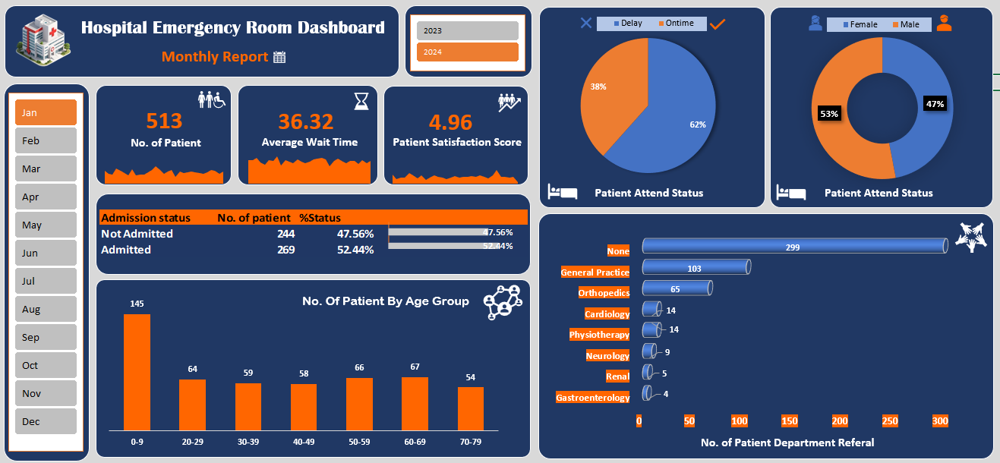

# 🏥 Hospital Emergency Room Dashboard  
### *Interactive Excel Dashboard for Emergency Care Analytics*

---

---

## 🚑 Project Overview

The **Hospital Emergency Room Dashboard** is a **dynamic and interactive Excel-based analytics solution** designed to monitor and improve **Emergency Room (ER) operations**.

This dashboard transforms raw hospital data into **clear visual insights**, helping stakeholders quickly understand patient flow, service efficiency, and departmental demand.

> 🎯 **Objective:** Enable data-driven decisions to reduce wait times, improve patient satisfaction, and optimize ER resources.

---

## 📊 Key Metrics (KPIs)

| KPI | Description |
|----|------------|
| 👥 **Total Patients** | Monthly ER patient count |
| ⏱ **Average Wait Time** | Average time patients wait for care |
| ⭐ **Patient Satisfaction Score** | Service quality indicator |
| 🏥 **Admission Status** | Admitted vs Not Admitted |
| 🧍‍♂️🧍‍♀️ **Gender Split** | Male vs Female patient ratio |
| ⌛ **Attendance Status** | On-time vs Delayed arrivals |

---

## 📈 Dashboard Analysis

### 🗓 Monthly & Yearly Trends
- Month-wise ER activity analysis
- Year comparison (2023 vs 2024)
- Identification of peak demand periods

### 👶👨‍🦳 Patient Demographics
- Age group distribution (0–9 to 70–79)
- Gender-based attendance insights

### 🏥 ER Performance Monitoring
- Admission rate tracking
- Average waiting time patterns
- Patient satisfaction performance

### 🔬 Department Referral Insights
- General Practice
- Orthopedics
- Cardiology
- Neurology
- Physiotherapy
- Gastroenterology
- Renal

---

## 🧠 Business Impact

✔ Improves emergency workflow visibility  
✔ Helps identify service delays  
✔ Supports staff allocation planning  
✔ Enhances patient experience  
✔ Enables fast operational decisions  

---

## 🛠 Tools & Techniques Used

- **Microsoft Excel**
  - Pivot Tables & Pivot Charts
  - Slicers & Timelines
  - Advanced Formulas
  - Conditional Formatting
- **Data Cleaning & Preparation**
- **Dashboard Design Principles**

---

## 🎨 Design Features

- Professional healthcare color theme  
- Icon-based visualization for quick insights  
- Fully interactive slicers (Month & Year)  
- Clean, executive-ready layout  
- User-friendly navigation  

---

## 📌 How to Use

1. Download the Excel file (`hospital latest project.xlsx`)
2. Open using **Microsoft Excel (2016 or later recommended)**
3. Use slicers to filter:
   - Year
   - Month
4. Explore KPIs and visual insights instantly  

---

## 🚀 Future Improvements

- 📊 Automated data refresh
- 📈 Trend forecasting using Excel formulas
- 🏥 Multi-hospital comparison
- 📱 Mobile-friendly dashboard layout

---

## 👤 Author

** Harshit Rathi **  
📊 Data Analyst | Excel Dashboard Developer  

---

### ⭐ If you found this useful, consider starring the repository!

